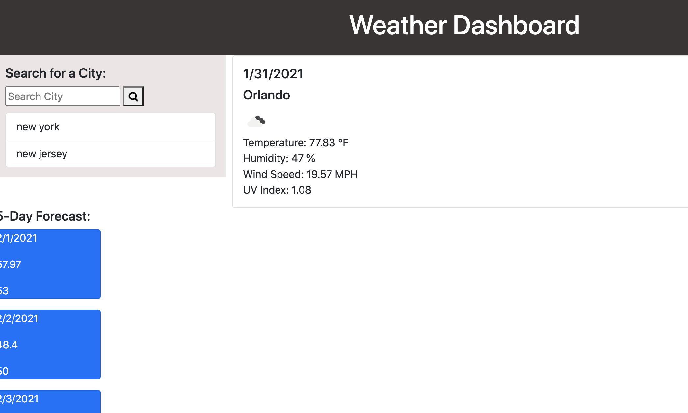

# Weather Dashboard

## User Story

As a person who enjoys traveling, I want to be able to see the weather of the city I am visiting so that I can plan accordingly. 

## Table of Content

* [Motivation](#motivation)
* [Description](#description)
* [Requirements](#requirements)
* [Screenshots](#screenshots)
* [Link to Page](#link-to-page)
* [Tools](#tools)

## Motivation

I want to create a weather dashboard application that allows me to see the weather forecast of any city. 

## Description

Build a weather dashboard that will run in the browser and feature dynamically updated HTML and CSS. Use the OpenWeather API to retrieve weather data for cities. The documentation includes a section called "How to start" that will provide basic setup and usage instructions. Use `localStorage` to store any persistent data.

## Requirements 

The weather dashboard should allow the user to:

* Search for a city and be presented with current and future conditions for that city and that city is added to the search history.
* View current weather conditions for that city and be presented with the city name, the date, an icon representation of weather conditions, the temperature, the humidity, the wind speed, and the UV index.
* View future weather conditions for that city and be presented with a 5-day forecast that displays the date, an icon representation of weather conditions, the temperature, and the humidity.
* Open the weather dashboard be presented with the last searched cities.

## Screenshots

## Link to Page

<https://esmendez90.github.io/weather-dashboard/>

## Tools

* Visual Studio Code <https://code.visualstudio.com>.
* OpenWeather API <https://openweathermap.org/api>.
* Chrome DevTools - Inspect.
 